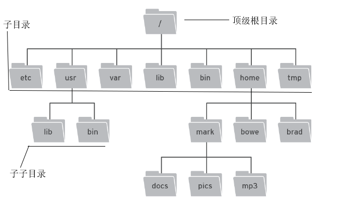
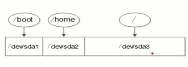

# Linux

- 内核版本
- 发行版本

### 内核版本
内核版本 也就是linux的核心版本
[内核版本官网](http://www.kernel.org)

> 版本号 2.6.18 其中，2表示主版本,6表示次版本，18表示末版本

### 发行版本
在内核版本之上修改添加某些工具，如图形界面等。这些版本就称之为各个厂商的发行版本，如redhat、debian、centOS、Ubuntu等。

> 就已知的发行版本已达到上千种，其中服务器优选redhat，其次是centOS,目前图形界面做得很好的是Ubuntu

##### 本笔记都是在CentOS 7上运行的命令

## linux上热门开源的软件
* Apache
* nginx
* mysql
* php
* MongoDB
* samba
* Python
* Ruby
* sphinx

> 开源软件不一定免费,但大部分都免费

开源软件特点：
1. 使用自由  -- 绝大多数开源软件免费
2. 研究自由  -- 可以获得软件源代码
3. 散布级改良自由  -- 可以自由传播，改良甚至销售

#Linux和Window的差别  

+ Linux 严格区分大小写
+ Linux中所有内容以文件的形式保存,包括用户,硬件

> 比如Window下的 计算机管理 是图形界面来操作，而Linux则是以文件配置的形式来设置

- **Linux不靠扩展名来区分文件类型**  

> windows中，有.ppt,.exe,.txt,.mp4,.doc等等扩展名,linux是靠权限来区分扩展名的,linux没有扩展名，但是有一些约定的“扩展名”,如:   
>> 压缩包 \*.gz , \*.bz2 , \*.tar.bz2 , \*.tgz等  
>> 二进制软件包 \*.rpm  
>> 网页文件 \*.html , \*.php  
>> 脚本文件 \*.sh  
>> 配置文件 \*.conf  
> 
> *就比如有两个压缩包的'扩展名'不一样,那么就说明这两个压缩的方法不一样,自然而然的解压缩也就不一样*   
> **也就是说:linux没有扩展名,写文件后缀只是为了方面操作,区分文件类型,在操作管理上方便**   

## 磁盘分区
> 磁盘分区是是使用分区编辑器(partition editor)在磁盘上划分几个逻辑部分，碟片一旦划分成数个分区(Partition)，不同类的目录与文件可以存储进不同的分区。

如在window系统中，把一个硬盘，分成C、D、E、F盘，每个盘就叫做分区
#### 通用 分区类型：
> 主分区：最多只能有4个
> 扩展分区：
>> 最多只能有1个
>> 主分区加扩展分区最多有4个
>> 不能写入数据，只能包含逻辑分区
>
> 逻辑分区

*解释：最早时候，硬盘只有一种分区，叫主分区，但是主分区有一个限制，最多主分区只能分四个，因为这主要是由硬盘结构决定的，整个硬盘分成一个一个等大小的block扇区，每个扇区是512字节(b),其中64个字节是分区表存储空间的，每个分区的参数占16个字节，故主引导扇区总计只能存储4个分区表数据，所以为了突破主分区只有4个的限制，引入了扩展分区和逻辑分区，把四个主分区中其中一个拿出来做扩展分区，扩展分区不能写入数据，只能在扩展分区上建立更过的逻辑分区。*

#### 格式化
> 格式化又称逻辑格式化，它是指根据用户选定的文件系统（如FAT12、FAT16、FAT32、NTFS、EXT2、EXT3等），在磁盘的特定区域写入特定数据，以达到初始化磁盘或磁盘分区、清除原磁盘或磁盘分区中所有文件的一个操作。

*简单地说，格式化就是为磁盘做初始化的工作，以便我们能够按部就班地往磁盘上记录资料。好比我们有一所大房子要用来存放书籍，我们不会搬来书往屋里地上一扔了事，而是要先在里面支起书架，标上类别，把书分门别类地放好。*

文件系统
> window识别的系统文件
>> * FAT16   最大只能支持2G的硬盘分区  
>> * FAT32  能支持最大16G的硬盘分区，但是单个文件最大不能超过4G  
>> * NTFS   (最新)
> 
> Linux能识别的系统文件  
>> EXT2、EXT3、EXT4(最新)

**文件系统格式化的时候干了啥事？**  
第一件事：将硬盘的某个整个分区分成等大小的数据块block,每个数据块大小默认分成4KB大小的单元空间(*这个单元空间可以修改*)，如果有一个大小为10KB的文件，那么存储时候，肯定在一个块里放不下，要存放这个文件需要3个数据块才能放下(`3个*4KB=12KB>10KB`),剩下的2KB单元大小空间无法再放入其他文件了，也就是说4KB是最小的存储空间。  
第二件事：3个数据块是无序的，需要用一个二维表格表来记录该文件的ID号(统叫:inode)，修改时间，文件权限和每个文件的数据块位置，读取数据时通过查找该表是否有权限，然后通过查找这三个数据块并拼接才能读取出这完整的文件。  
格式化就是重新规划分区块大小和二维表格，所以存储在硬盘上分区内的数据肯定会被清空。即格式化会清空数据，但是格式化的目的不是为了清空数据，**格式化的目的是写入文件系统**  

# 分配
> window系统  
>> 分区--格式化--分配盘符
>
>Linux系统  
>>分区--格式化--给每个分区起设备文件名--挂载(分配盘符)

#### 设备文件名
|硬件|设备文件名
|:--------:|:--------:|
|IDE硬盘|`/dev/hd[a-d]`
|SCSI/SATA/USB硬盘|`/dev/sd[a-p]`
|光驱|`/dev/cdrom或/dev/hdc`
|软盘|`/dev/fd[0-1]`
|打印机(25针)|`/dev/lp[0-2]`
|打印机(USB)|`/dev/usb/lp[0-15]`
|鼠标|`/dev/mouse`

在linux有一个概念：**每一个硬件都是文件**，或者说：**任何内容都是文件**  
即：设备文件名就是这么来的

分析：   `/dev/sda2`
其中第一个`/`为根目录，linux系统中顶级目录是根目录，根目录下又有二级子目录、三级子子目录等等。

* `dev` 是保存所有设备文件名的二级目录
* `sda2` 拆分出来：  
    * `sd`代表 SCSI或者SATA或者USB硬盘接口  
    * `a`  代表 第一块硬盘设备  
    * `2`  代表 第2个硬盘分区，也叫作分区号  

#### 分区号：
其中1,2,3,4这四个分区号分别给主分区或者扩展分区，逻辑分区一定从分区号5开始。

### 挂载
建立好分区，剩下的就是分配盘符，其中，盘符的概念是Window的概念，在Linux中使用 **挂载点** 来表示Window中的盘符，挂载就是分配挂载点的过程，在Linux中不想Window中使用A、B、C、D来作为挂载点，而是使用目录作为挂载点
> 必须分区
> * **`\`  根分区**  
> * **swap分区**(交换分区，低于2G内存的建议设置当前内存的2倍，高于2G内存的设置为当前内存相当)，也称为虚拟内存，当真实内存不够时linux就会调用这个swap交换分区充当内存来使用。它是文件系统类型的一种分区
>
>推荐分区
>> /boot/ (启动分区，建议250MB)  
>> /home/ 用户分区

#Linux命令
首先使用root超级管理员登陆Linux系统  
`[root@localhost ~]# _`  
分析：
> `root`  超级管理员用户名
>> 当前登陆系统用户
> 
> `@`  无意义
>
> `localhost`  本地主机名
>> 当前系统主机的名称
>
> `~`
>> `~`位置表示当前用户所在目录(`~`为当前用户的家目录) 
> 
> `#`
>> `#`表示超级用户标识符；   `$`表示普通用户标识符

## 命令格式
> 命令 [选项] [参数]
>> 其中选线和参数为可选参数
>> 多个命令可以简写 如：`ls -l -h` 简写为 `ls -lh`

### ls命令
> 查询目录内容

|选项|说明
|------|------
|`-a`|显示所有包含隐藏的文件
|`-l`|显示详细信息
|`-d`|查看目录属性
|`-h`|人性化查看文件大小
|`-i`|显示每个文件的inode

如  
`ls -lhi /root/anaconda-ks.cfg`  
*查看/root/下的文件anaconda-ks.cfg详细文件*

#### 文件或目录的权限
`-rw-r--r--. 1 root root 1162 dec 2 12:00 anaconda-ks.cfg`  
默认10位
> 第一位 `-`
>> 文件类型，其中  `-`文件；`d`目录；`l`软连接文件(快捷方式)
> 
> 后面9位每三位代表 `rw-` 所有者、`r--`所属组、`r--`其他人
> 
> `r` 读；`w`写；`x`执行
>
> `.`
>> `ACL权限`
>
> `1`
>> 引用计数,也就是文件调用次数
>
> `root`
>> 第一个 `root` 代表文件所有者为root,第二个`root`代表文件所属组为root组
>
> `1162`
>> 文件大小

## 目录处理命令
### mkdir命令
> 目录皆文件，目录也是文件的一种，目录是用来保存文件的，而普通文件是用来保存数据的

mkdir 英文：make directories,其意思是创建目录

|选项|说明
|------|------
|`-p`|递归创建

如：  
`mkdir -p /root/test/01`  
其中，root目录下没有test，使用`-p`选项可以递归创建test目录，然后继续创建test下的01目录  

### cd命令
英文名change dirctory

|选项|说明
|------|------
|`cd ~`|进入当前用户的家目录
|`cd `|  和`cd ~`一样
|`cd -`|进入上次目录
|`cd ..`|进入上级目录
|`cd .`|进入当前目录

快捷键 `Ctrl+L`:清空窗口

#### 相对路径和绝对路径
这你都不懂？啧啧啧...

### 目录补全
假设想进入系统根目录是否存在usr目录，但是不知道根目录的有没有这个usr目录，可以通过按Tab键来查看想进入的根目录里有所有文件：
如：
* 进入usr输入 `cd /` 
* 按两次Tab键查看/根目录
* 发现有usr目录，然后在命令行继续上次补全路径  `cd /usr/`进入目录

